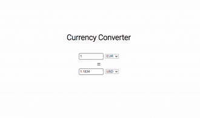

# Description

A currency converter made using React. Takes in currencies and exchange rates from the ExchangeRate-API here: https://app.exchangerate-api.com/usage

This program makes use of Hooks like useState and useEffect to fetch API data and update currency values in real-time. It is a simple program just to showcase what I am currently learning in React.

# Demo

